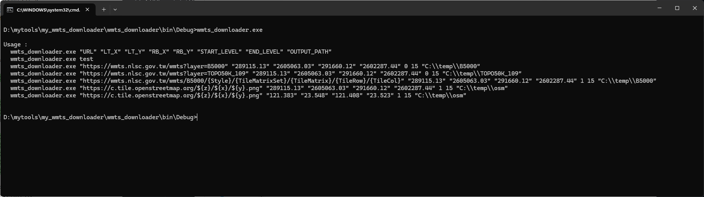
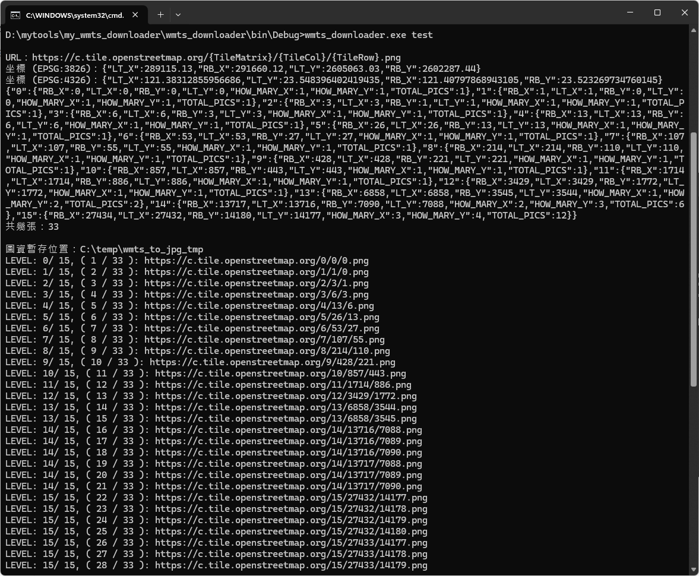
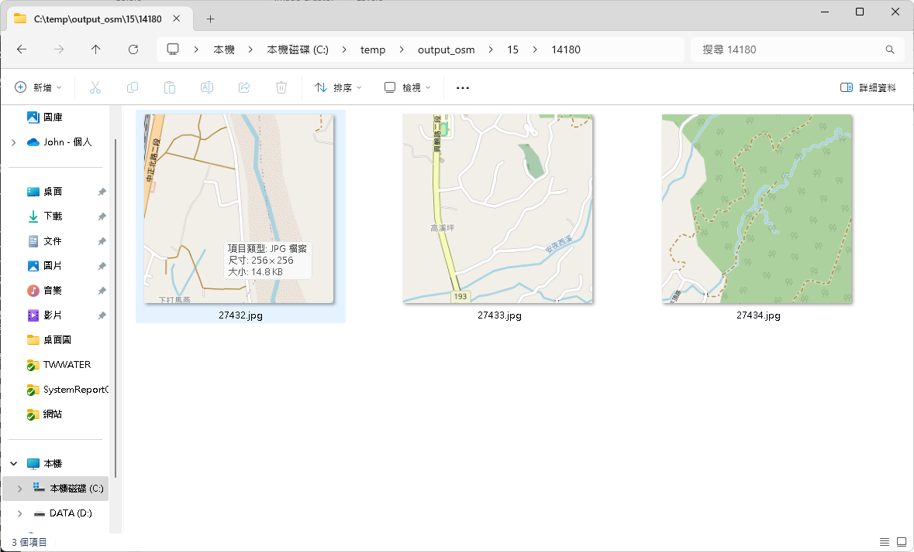

# my_wmts_to_jpg
我的 wmts 圖資下載機

<h2>Author</h2>
羽山秋人 (https://3wa.tw)

<h2>License</h2>
MIT
 

<h2>程式執行</h2>

wmts_to_jpg.exe [WMTS URL] [LT_X] [LT_Y] [RB_X] [RB_Y] [START_LEVEL] [END_LEVEL] [OUTPUT_PATH]

<h2>使用方法</h2>

<table border="1" cellpadding="0" cellspacing="0" style="padding:3px;">
<thead>
<tr>
    <th>項次</th>
    <th>名稱</th>
    <th>功能</th>
    <th>範例</th>
</th>
</thead>
<tbody>
<tr>
    <td>1</td>
    <td>WMTS URL</td>
    <td>傳入 WMTS 網址</td>
    <td>
https://c.tile.openstreetmap.org/${z}/${x}/${y}.png
或
https://c.tile.openstreetmap.org/{TileMatrix}/{TileCol}/{TileRow}.png
    </td>
</tr>
<tr>
    <td>2</td>
    <td>LT_X</td>
    <td>傳入 左上角 Longitude</td>
    <td>(WGS84) 121.383 或 (EPSG:3826) 289115.13</td>
</tr>    
<tr>
    <td>3</td>
    <td>LT_Y</td>
    <td>傳入 左上角 Latitude</td>
    <td>(WGS84) 23.548 或 (EPSG:3826) 2605063.03</td>
</tr>
<tr>
    <td>4</td>
    <td>RB_X</td>
    <td>傳入 右下角 Longitude</td>
    <td>(WGS84) 121.408 或 (EPSG:3826) 291660.12</td>
</tr>
<tr>
    <td>5</td>
    <td>RB_Y</td>
    <td>傳入 右下角 Latitude</td>
    <td>(WGS84) 23.523 或 (EPSG:3826) 2602287.44</td>
</tr>
<tr>
    <td>6</td>
    <td>START_LEVEL</td>
    <td>開始的 Zoom Level 如 0</td>
    <td>0</td>
</tr>
<tr>
    <td>7</td>
    <td>END_LEVEL</td>
    <td>結束的 Zoom Level 如 15</td>
    <td>15</td>
</tr>
<tr>
    <td>8</td>
    <td>OUTPUT_PATH</td>
    <td>輸出目錄，會自動建立 Z/X/Y.jpg</td>
    <td>如：C:\temp\osm</td>
</tr>
</tbody>
</table>

<h2>Usage:</h2>

wmts_downloader.exe

<h2>Usage：</h2>
  wmts_downloader.exe "URL" "LT_X" "LT_Y" "RB_X" "RB_Y" "START_LEVEL" "END_LEVEL" "OUTPUT_PATH"
  wmts_downloader.exe test 
  test 模式，會嘗試下載 osm 台中市範圍 0~15 階，檔案輸出至 "C:\\temp\\output_osm"
  
  wmts_downloader.exe "https://wmts.nlsc.gov.tw/wmts?layer=B5000" "289115.13" "2605063.03" "291660.12" "2602287.44" "B5000.jpg" 0 15 "C:\\temp\\B5000"
  wmts_downloader.exe "https://wmts.nlsc.gov.tw/wmts?layer=TOPO50K_109" "289115.13" "2605063.03" "291660.12" "2602287.44" "out.jpg"
  wmts_downloader.exe "https://wmts.nlsc.gov.tw/wmts/B5000/{Style}/{TileMatrixSet}/{TileMatrix}/{TileRow}/{TileCol}" "289115.13" "2605063.03" "291660.12" "2602287.44" 0 15 "C:\\temp\\B5000"
  wmts_downloader.exe "https://c.tile.openstreetmap.org/${z}/${x}/${y}.png" "289115.13" "2605063.03" "291660.12" "2602287.44" 0 15 "C:\\temp\\B5000"
  wmts_downloader.exe "https://c.tile.openstreetmap.org/${z}/${x}/${y}.png" "121.383" "23.548" "121.408" "23.523" 0 15 "C:\\temp\\B5000"

<h2>設定檔參數：</h2>
wmts_to_jpg.exe.config

    
<h2>縮圖參考：</h2>
  

    
    使用方法列表    
         
     
    
    Run test
         
     
    
    Osm 範例
         
         
  

<h2>Todo：</h2>
  1. 可指定輸出 SQLITE 或 ZIP