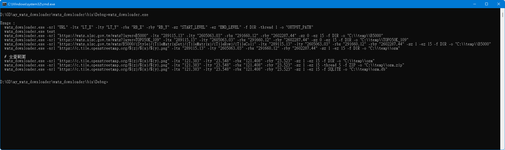
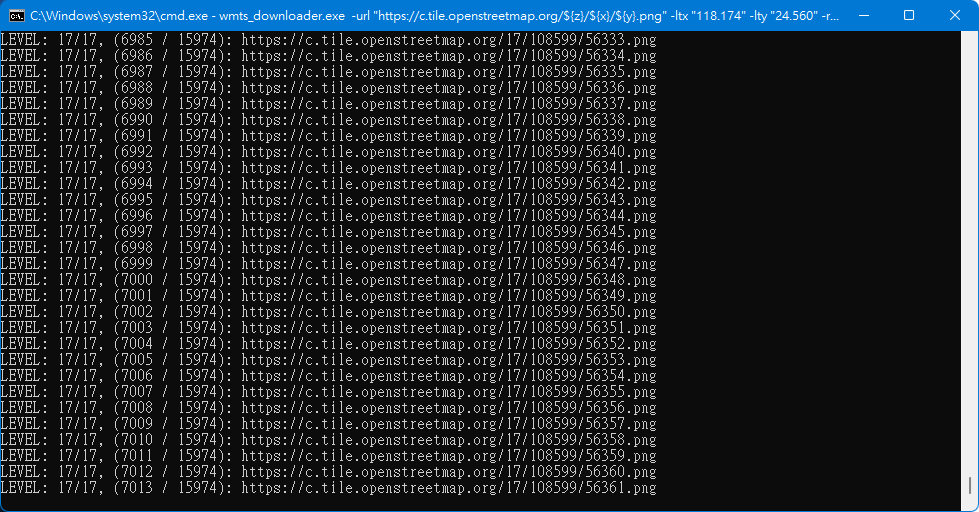
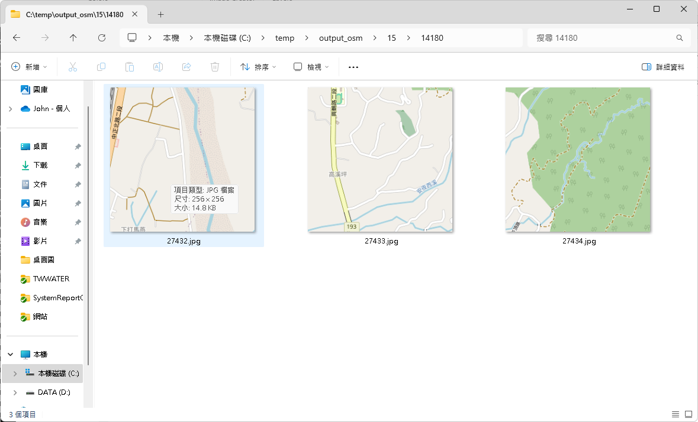

# my_wmts_to_jpg
我的 wmts 圖資下載機

<h2>Author</h2>
羽山秋人 (https://3wa.tw)

<h2>版本</h2>
V0.02

<h2>License</h2>
MIT
 

<h2>程式執行</h2>

wmts_to_jpg.exe -url [WMTS URL] -ltx [LT_X] -lty [LT_Y] -rbx [RB_X] -rby [RB_Y] -sz [START_LEVEL] -ez [END_LEVEL] -f [FILE_FORMAT] -o [OUTPUT_PATH, OUTPUT_ZIP, OUTPUT_SQLITE]

<h2>使用方法</h2>

<table border="1" cellpadding="0" cellspacing="0" style="padding:3px;">
<thead>
<tr>
    <th>項次</th>
    <th>名稱</th>
    <th>功能</th>
    <th>範例</th>
</th>
</thead>
<tbody>
<tr>
    <td>1</td>
    <td>-url WMTS URL</td>
    <td>傳入 WMTS 網址</td>
    <td>
https://c.tile.openstreetmap.org/${z}/${x}/${y}.png
或
https://c.tile.openstreetmap.org/{TileMatrix}/{TileCol}/{TileRow}.png
    </td>
</tr>
<tr>
    <td>2</td>
    <td>-ltx LT_X</td>
    <td>傳入 左上角 Longitude</td>
    <td>(WGS84) 121.383 或 (EPSG:3826) 289115.13</td>
</tr>    
<tr>
    <td>3</td>
    <td>-lty LT_Y</td>
    <td>傳入 左上角 Latitude</td>
    <td>(WGS84) 23.548 或 (EPSG:3826) 2605063.03</td>
</tr>
<tr>
    <td>4</td>
    <td>-rbx RB_X</td>
    <td>傳入 右下角 Longitude</td>
    <td>(WGS84) 121.408 或 (EPSG:3826) 291660.12</td>
</tr>
<tr>
    <td>5</td>
    <td>-rby RB_Y</td>
    <td>傳入 右下角 Latitude</td>
    <td>(WGS84) 23.523 或 (EPSG:3826) 2602287.44</td>
</tr>
<tr>
    <td>6</td>
    <td>-sz START_LEVEL</td>
    <td>開始的 Zoom Level 如 0</td>
    <td>0</td>
</tr>
<tr>
    <td>7</td>
    <td>-ez END_LEVEL</td>
    <td>結束的 Zoom Level 如 15</td>
    <td>15</td>
</tr>
<tr>
    <td>8</td>
    <td>-f FILE_FORMAT</td>
    <td>輸出格式</td>
    <td>
		DIR [目錄與檔案] 
		ZIP [壓縮檔 ZIP 
		SQLITE [SQLite Database] 		
	</td>
</tr>
<tr>
    <td>9</td>
    <td>-thread 多執行緒</td>
    <td>
		如： -thread 5
	</td>
    <td>
		如：C:\temp\osm 
		如：C:\temp\osm.zip 
		如：C:\temp\osm.db 
	</td>
</tr>
<tr>
    <td>10</td>
    <td>-o OUTPUT_PATH、OUTPUT_ZIP、OUTPUT_SQLITE</td>
    <td>
		輸出目錄：建立目錄，裡面包含 Z/X/Y.jpg 
		輸出ZIP(.zip)檔：輸出壓縮檔 zip，裡面為：Z/X/Y.jpg 
		輸出DB(.db, .sqlite)檔：輸出SQLite 檔，裡面為 資料表名：`tiles` 欄位：z, x, y, tile_data (blob)
	</td>
    <td>
		如：C:\temp\osm 
		如：C:\temp\osm.zip 
		如：C:\temp\osm.db 
	</td>
</tr>
</tbody>
</table>

<h2>Usage:</h2>

wmts_downloader.exe

<h2>Usage：</h2>
  wmts_downloader.exe -url "URL" -ltx "LT_X" -lty "LT_Y" -rbx "RB_X" -rby "RB_Y" -sz "START_LEVEL" -ez "END_LEVEL" -f "FileFormat" -o "OUTPUT_PATH"
  wmts_downloader.exe test 
  test 模式，會嘗試下載 osm 台中市範圍 0~15 階，檔案輸出至 "C:\\temp\\output_osm"
  
  wmts_downloader.exe -url "https://wmts.nlsc.gov.tw/wmts?layer=B5000" -ltx "289115.13" -lty "2605063.03" -rbx "291660.12" -rby "2602287.44" -sz 0 -ez 15 -f DIR -o "C:\\temp\\B5000"
  wmts_downloader.exe -url "https://wmts.nlsc.gov.tw/wmts?layer=TOPO50K_109" -ltx "289115.13" -lty "2605063.03" -rbx "291660.12" -rby "2602287.44" -sz 0 -ez 15 -f ZIP -o "C:\\temp\\B5000.zip"
  wmts_downloader.exe -url "https://wmts.nlsc.gov.tw/wmts?layer=TOPO50K_109" -ltx "289115.13" -lty "2605063.03" -rbx "291660.12" -rby "2602287.44" -sz 0 -ez 15 -f SQLITE -o "C:\\temp\\B5000.db"
  wmts_downloader.exe -url "https://wmts.nlsc.gov.tw/wmts/B5000/{Style}/{TileMatrixSet}/{TileMatrix}/{TileRow}/{TileCol}" -ltx "289115.13" -lty "2605063.03" -rbx "291660.12" -rby "2602287.44" -sz 0 -ez 15 -f DIR -o "C:\\temp\\B5000"
  wmts_downloader.exe -url "https://c.tile.openstreetmap.org/${z}/${x}/${y}.png" -ltx "289115.13" -lty "2605063.03" -rbx "291660.12" -rby "2602287.44" -sz 0 -ez 15 -f DIR -o "C:\\temp\\B5000"
  wmts_downloader.exe -url "https://c.tile.openstreetmap.org/${z}/${x}/${y}.png" -ltx "121.383" -lty "23.548" -rbx "121.408" -rby "23.523" -sz 0 -ez 15 -f DIR -o "C:\\temp\\osm"
  wmts_downloader.exe -url "https://c.tile.openstreetmap.org/${z}/${x}/${y}.png" -ltx "121.383" -lty "23.548" -rbx "121.408" -rby "23.523" -sz 0 -ez 15 -f ZIP -o "C:\\temp\\osm.zip"
  wmts_downloader.exe -url "https://c.tile.openstreetmap.org/${z}/${x}/${y}.png" -ltx "121.383" -lty "23.548" -rbx "121.408" -rby "23.523" -sz 0 -ez 15 -f SQLITE -o "C:\\temp\\osm.db"
  wmts_downloader.exe -url "https://c.tile.openstreetmap.org/${z}/${x}/${y}.png" -ltx "121.383" -lty "23.548" -rbx "121.408" -rby "23.523" -sz 0 -ez 15 -f SQLITE -o "C:\\temp\\osm.sqlite"
  
  臺灣範圍
  wmts_downloader.exe -url "https://c.tile.openstreetmap.org/${z}/${x}/${y}.png" -ltx "120.042" -lty "25.387" -rbx "122.030" -rby "21.785" -sz 0 -ez 15 -f ZIP -thread 5 -o "C:\\temp\\osm.zip"
  
  金門
  wmts_downloader.exe -url "https://c.tile.openstreetmap.org/${z}/${x}/${y}.png" -ltx "118.174" -lty "24.560" -rbx "118.527" -rby "24.319" -sz 0 -ez 15 -f ZIP -thread 5 -o "C:\\temp\\osm.zip"

  澎湖
  wmts_downloader.exe -url "https://c.tile.openstreetmap.org/${z}/${x}/${y}.png" -ltx "119.262" -lty "23.826" -rbx "119.778" -rby "23.157" -sz 0 -ez 15 -f ZIP -thread 5 -o "C:\\temp\\osm.zip"  
  
  馬祖、連江
  wmts_downloader.exe -url "https://c.tile.openstreetmap.org/${z}/${x}/${y}.png" -ltx "119.87" -lty "26.291" -rbx "120.049" -rby "26.133" -sz 0 -ez 15 -f ZIP -thread 5 -o "C:\\temp\\osm.zip"  

<h2>設定檔參數：</h2>
wmts_to_jpg.exe.config

    
<h2>縮圖參考：</h2>
  

    
    使用方法列表    
         
     
    
    Run test
         
     
    
    Osm 範例
         
         
  

<h2>ChangeLog：</h2>
  (2025-03-30) 1. 可指定輸出 SQLITE 或 ZIP
  (2025-03-30) 2. 可多執行緒執行